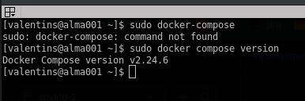
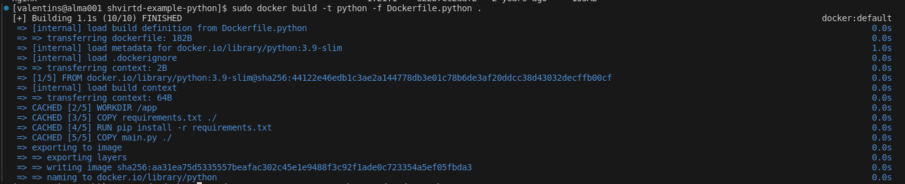
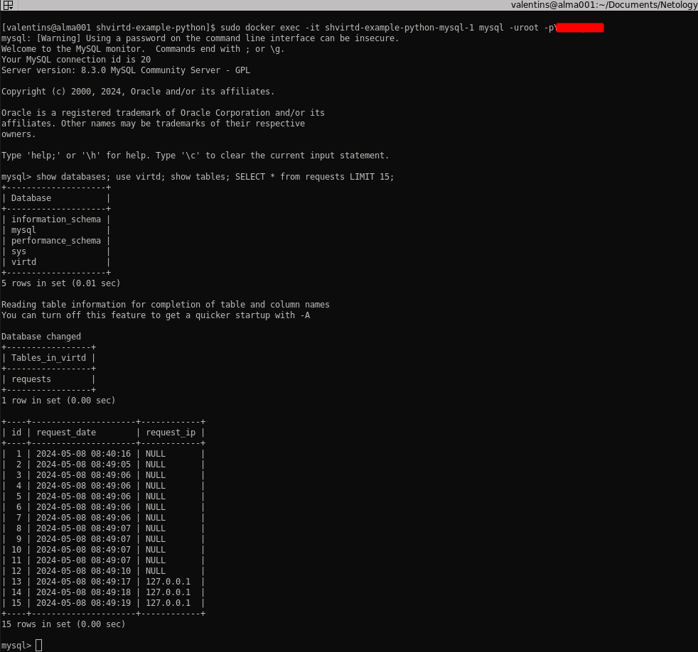
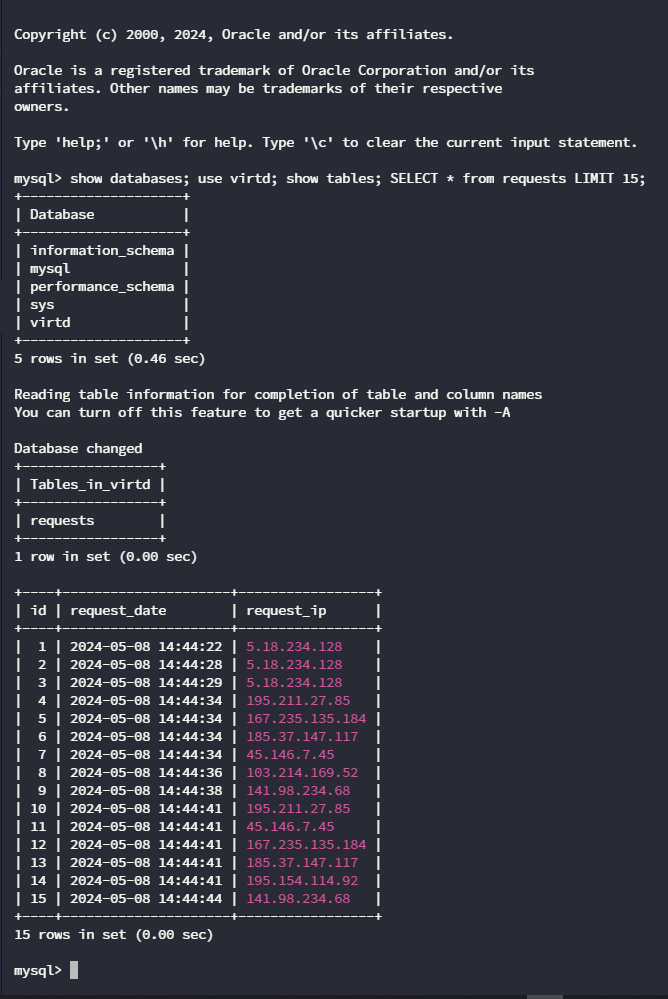
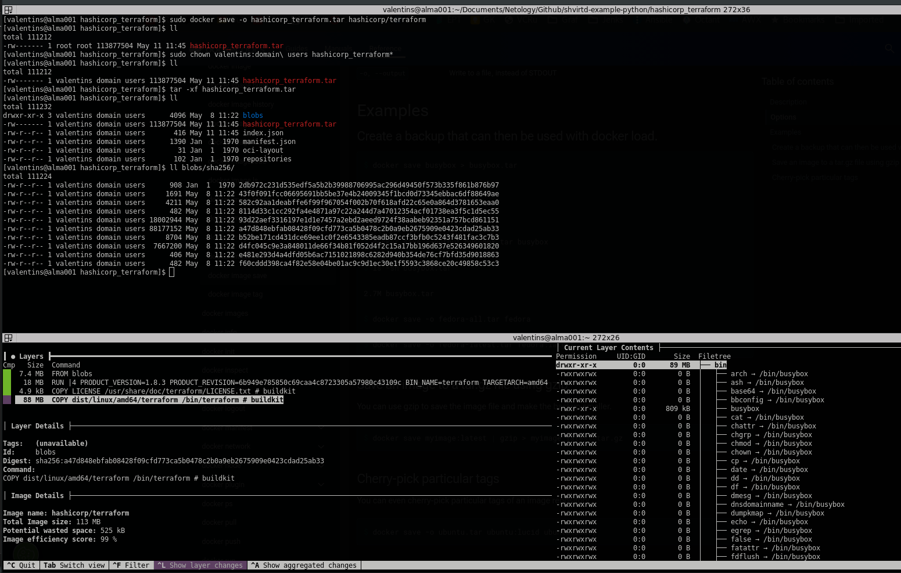
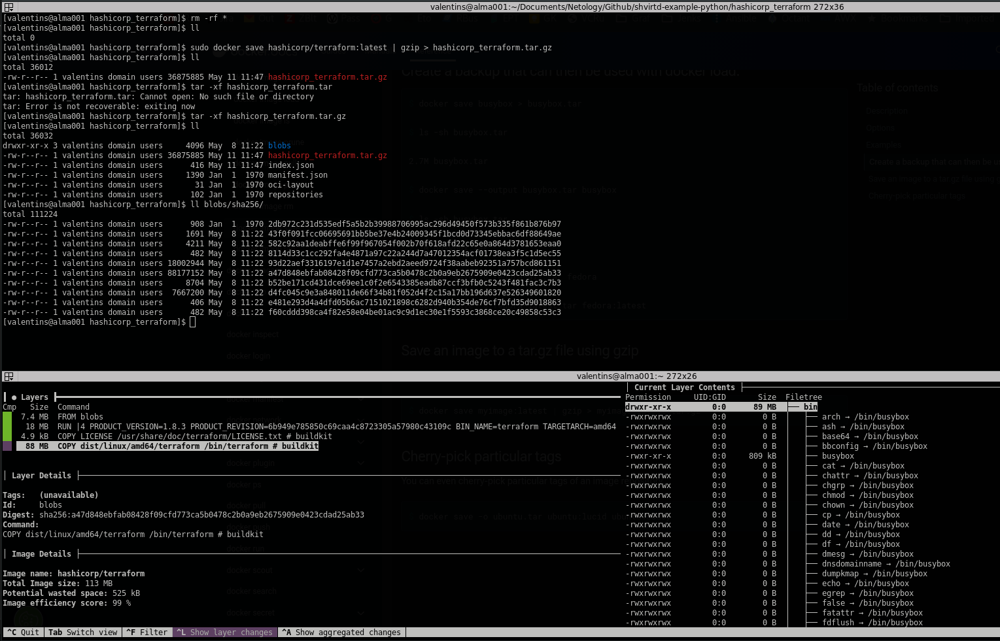
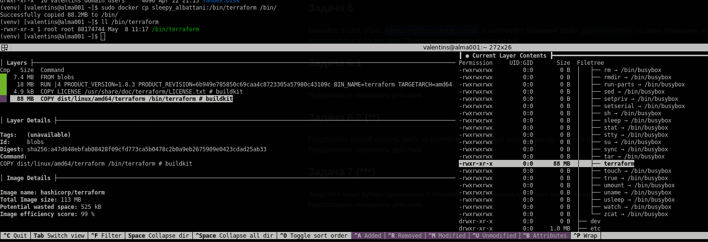

## Задача 0
Docker compose insted of docker-compose:\

## Задача 1
Starting and testing project:

## Задача 3
Sql query:

## Задача 4
Sql query on Yandex Cloud VM:

## Задача 6
Docker save(не получилось. пробовал двумя способами, в архиве нет нужного каталога.)\
Первый способ: 
>docker save -o hashicorp_terraform.tar hashicorp/terraform

Второй способ:
>docker save hashicorp/terraform:latest | gzip > hashicorp_terraform.tar.gz

Команды взяты из документации(+ Евгений подсказал):[Docker docs](https://docs.docker.com/reference/cli/docker/image/save/)
## Задача 6.1
Docker cp:

